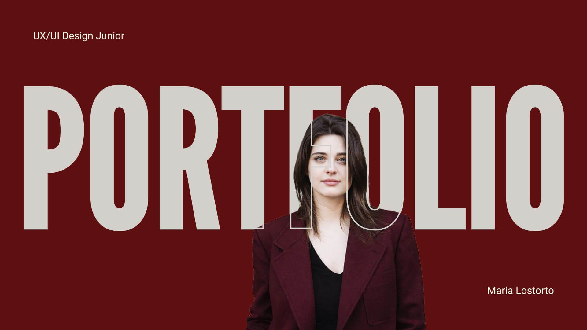

# marylost.github.io

# Maria Lostorto Personal Portfolio

This repository contains my personal portfolio website, created to showcase my work, skills, and projects as a designer and developer.
The portfolio is designed to present my professional profile and selected projects to companies, recruiters, and collaborators.
I design inclusive digital experiences where technology and humanity meet.  

---

## Table of Contents

* [About the Project](#about-the-project)
* [Live Demo](#live-demo)
* [Built With](#built-with)
* [Website Structure](#website-structure)
* [Features](#features)
* [Contact](#contact)
* [License](#license)

---

## About the Project

This project is my personal portfolio website.

The goal of the website is to present my work, background, and projects clearly and accessibly to potential employers and collaborators.

The website contains both **Italian and English versions** to reach a wider audience.

**Total Pages:**

* 3 pages in Italian
* 3 pages in English

Each version contains:

* Homepage
* Resume
* About & Contact

---

## Live Demo

The portfolio is published online using GitHub Pages.

Website:
https:

---

## Preview

  

---

## Built With

This project was built using the following technologies:

* HTML
* CSS
* SCSS
* JavaScript
* Bootstrap

---

## Website Structure

 The portfolio comprises six pages, featuring three pages in Italian and their corresponding English translations.  

### Homepage

Sections included:

* Navbar
* Hero section
* About Me
* Projects
* Marquee section
* Contact Form
* Footer

### Resume

* Navbar
* Hero section
* Two-column layout with my CV and experience
* Footer

### About & Contact

* Navbar
* Hero section
* Beyond Portfolio section
* Marquee section
* Contact Form
* Footer

---

## Features

* Responsive layout
* Sticky navigation menu
* Flexbox and CSS Grid layout system
* Clean and minimal design
* Bootstrap 
* Contact form
* Multilingual structure (Italian / English)
* Custom favicon
* Modular page structure

---

## Contact

Maria Lostorto

Email: marialostorto2@gamil.com

LinkedIn: www.linkedin.com/in/maria-lostorto

Behance: [your-behance](https://www.behance.net/marialostorto)

Project Repository:
https:

---

## License

This project is licensed under the MIT License.

If you reuse or modify this project, please provide credit by linking back to this repository.
The design, images and personal content of this portfolio may not be reused without permission.
